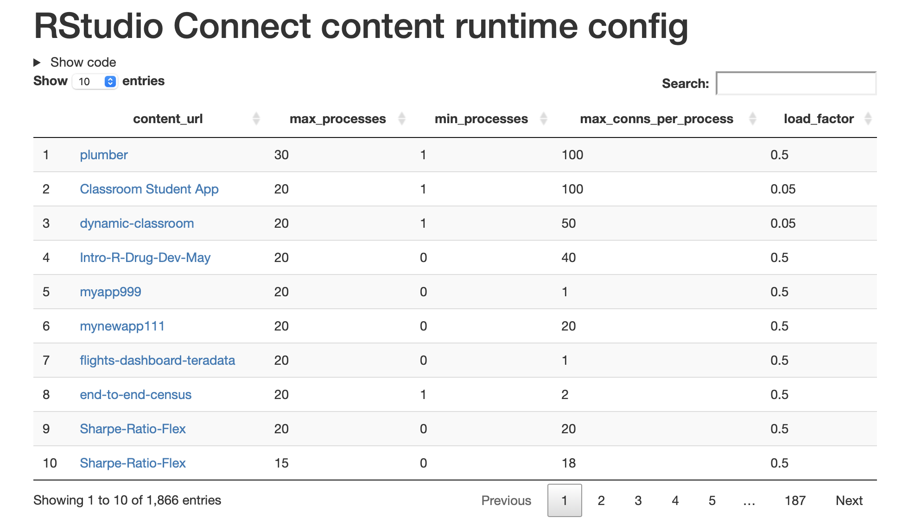

# RSC runtime config report

A short report that uses the [RStudio Connect API](https://docs.rstudio.com/connect/api/#get-/v1/content) to display a table of runtime configuration settings for each piece of deployed content.

## Usage

Review the `config` block near the top of the document and then deploy to RStudio Connect with the correct environment variables if necessary.

## Publishing

The report is ready to publish to RStudio Connect. Either clone the repo and handle publishing to your own instance of Connect yourself, or fork the repo and use Connect's "[git-backed](https://docs.rstudio.com/connect/user/git-backed/")  publishing feature. Do **not** use git-backed publishing with the "Sol-Eng" organisation master repo, as the content is subject to change without warning.

## License

MIT © RStudio, PBC. (See [license file](LICENSE.md) for more info.)
